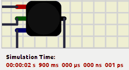

# Arduino Heart Lub Dub
A library made in CPP for Arduino for simulating heart beat lub dub. You can connect your LEDs or Motors to flash to a sound of LUB and DUB of a heartbeat.


<center>



</center>


# Getting started
1. Add `#include <ArduinoHeartLubDub.h>` at the top of your file
2. Define 4 function `lub`, `afterLub`, `dub`, `afterDub`
3. Define `bpm` value for controlling the speed of the blink.
4. Add `cardiacCycle` function execution in the `loop`
    ```cpp
        void loop()
        {
            cardiacCycle(
                bpm,
                lub,
                afterLub,
                dub,
                afterDub
            );
        }
    ```

## Example code
```cpp
#include <ArduinoHeartLubDub.h>

/**
 * LED OUTPUT PIN
 * */
int ledPin = 10;

/**
 * Set the bpm of the led
 */
int bpm = 60;


/**
 * Cardiac cycle - LUB
 */
void lub()
{
    analogWrite(ledPin, 255);
}

/**
 * Cardiac cycle - After LUB is done
 */
void afterLub()
{
    analogWrite(ledPin, 0);
}

/**
 * Cardiac cycle - DUB
 */
void dub()
{
    analogWrite(ledPin, 60); // <-- make it a bit dimmer on second flash
}

/**
 * Cardiac cycle - After DUB is done
 */
void afterDub()
{
    analogWrite(ledPin, 0);
}

void setup()
{
    pinMode(ledPin, OUTPUT);
}

void loop()
{
    // This needs to be executed every loop
    // It's not thread blocking
    // Unless you block the thread in the lub, afterLub, dub, afterDub functions
    cardiacCycle(
        bpm,
        lub,
        afterLub,
        dub,
        afterDub);
}
```

# Demo
Checkout the demo on [Wokwi](https://wokwi.com/projects/399433610062644225)

# Learn more
I have a website where I documented the project, if you want to get some insights or try Simulated DEMO you can check it out in my [cookbook](https://dev-cookbook-by-dawid.vercel.app/Arduino/heart-beat-lub-dub).